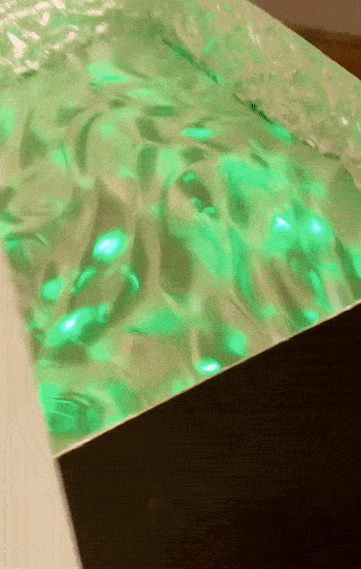

# smartled_hack
A reverse-engineering effort for Smart LED products.
This project provides tools to control off-the-shelf smart LED products.


## Hardware
- Raspberry Pi 3B+ (or any Linux/Bluetooth-capable devices)
- AKEPO Small Size 16W RGBW APP Twinkle Fiber Optic Lights (Amazon [link](https://www.amazon.com/dp/B0B67YTSYZ?ref=ppx_pop_mob_ap_share))

## Requirements
- Python libraries
  ```
  pip install asyncio bleak
  ```

## Preliminary Finding
- It is a Bluetooth GATT device
- Destination Address: `21:0a:00:06:5a:b2`
- Handle: `0x000d`
- UUID: `0000ffb1-0000-1000-8000-00805f9b34fb`
- Configs:
  * `power`: `00` or `ff` (off and on)
  * `color`: `ff0000` (red, in hex)
  * `twinkle`: `ff04` (on, speed 4)

## Demo
This device is the work by Wan-Chien Lin, featuring in LEDucation 2023.



## Presets
The presets are shared between `PRESET` mode and `SOUND` mode.

  	1. seven color fade
  	2. RGB fade
  	3. seven color breathe
  	4. RGB breathe
  	5. red & green fade
  	6. red & blue fade
  	7. green & blue fade
  	8. seven color jump
  	9. RGB jump
  	10. seven color flash
  	11. RGB flash
  	12. red flash
  	13. green flash
  	14. blue flash
  	15. yellow flash
  	16. purple flash
  	17. cyan flash
  	18. white flash
  	19. yellow & purple flash
  	20. purple & cyan flash

## Packet Structure
total = 20 bytes
```
00: header 'a5'
01: power 'ff'/'00' (on/off)
02: operation mode: 0x00 for preset, 0x01 for manual, 0x04 for Sound mode
03: preset 0x00 - 0x13 (0 - 19, 20 presets). 0x00 or 0xff if manual?
04: speed 0x01 - 0x0a (1 - 10, 10 speeds) (seems not revelent in manual mode)
05: R 0x00 - 0xff (seems all 0x00 in preset mode)
06: G 0x00 - 0xff
07: B 0x00 - 0xff
08: padding 0x00
09: brightness 0x01 - 0x64 (1 - 100, 100 levels)
10: Sound on/off 0x00 or 0xff
11: Sound preset 0x00 - 0x13 (0 - 19, 20 modes)
12: Sound sensitivity 0x01 - 0x0a (1 - 10, 10 levels)
13: twinkle_toggle 0x00 or 0xff (off/on)
14: twinkle speed 0x01 - 0x04 (1 - 4, 4 speeds)
15: meteor on/off 0x00 or 0xff (on/off)
16: meteor preset 0x01 - 0x14 (1 - 20, 20 presets)
17: meteor speed 0x01 - 0x0a (1 - 10, 10 speeds)
18: padding 0x00
19: padding 0xaa
```

## Command Template (WIP)
```
f'{header}{power}{mode}{preset}{speed}{color}{padding_1}{brightness}{sound_toggle}{sound_preset}{sound_sensitivity}{twinkle_toggle}{twinkle_speed}{meteor_toggle}{meteor_preset}{meteor_speed}{padding_2}'

where:
  header:             0xa5
  power:              0x00 or 0xff (off or on)
  mode:               0x00 for preset; 0x01 for manual; 0x04 for Sound mode
  preset:             0x00 - 0x13 (0 - 19, 20 presets)
  speed:              0x01 - 0x0a (1 - 10, 10 speeds)
  color:              0xRR 0xGG 0xBB (hex RGB color values, 3 bytes)
  padding_1:          0x00
  brightness:         0x01 - 0x64 (1 - 100, 100 levels)
  sound_toggle:       0x00 or 0xff (off or on)
  sound_preset:       0x00 - 0x13 (0 - 19, 20 modes)
  sound_sensitivity:  0x01 - 0x0a (1 - 10, 10 levels)
  twinkle_toggle:     0x00 or 0xff (off or on)
  twinkle_speed:      0x01 - 0x04 (1 - 4, 4 speeds)
  meteor_toggle:      0x00 or 0xff (off or on)
  meteor_preset:      0x01 - 0x14 (1 - 20, 20 presets)
  meteor_speed:       0x01 - 0x0a (1 - 10, 10 speeds)
  padding_2:          0x00 0xaa (2 bytes)
```
